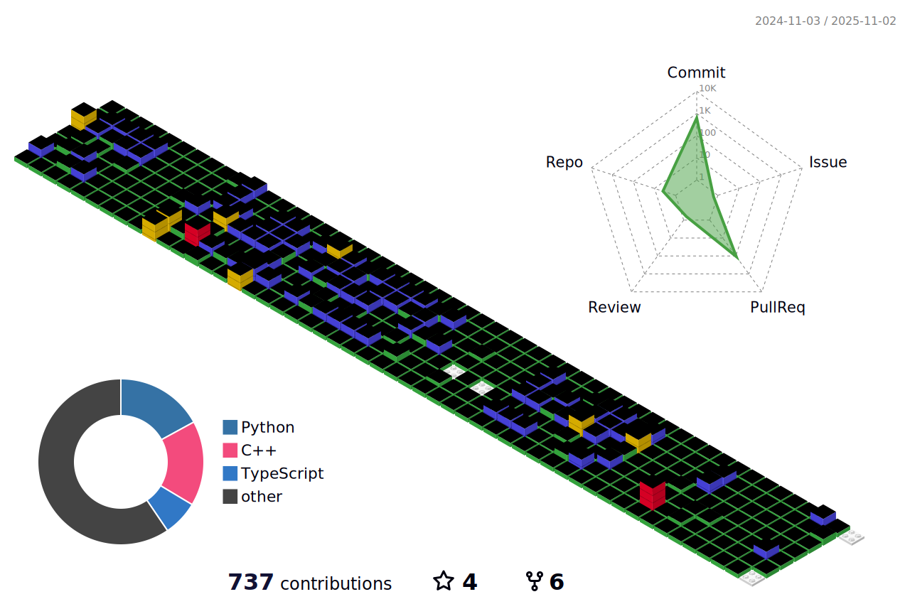

  

  <h2> 👋 Introdution 👋 </h2>
  파도처럼 "유연"하고 "막힘"없이 성장하고 싶은 개발자 양진혁입니다.
    
  
  

  <h2> 🎓 Education 🎓 </h2>
   
  <table>
    <tr>
      <th>Period</th>
      <th>Institution</th>
    </tr>
    <tr>
      <td>2024.03 - Present</td>
      <td>Shinhan Securities Pro Digital Academy</td>
    </tr>
    <tr>
      <td>2022.03 - 2024.02</td>
      <td>HUFS University Computer Science and Engineering</td>
    </tr>
  </table>
  

  

  <h2> 🌱 Tech Stack 🌱 </h2>
  
   
  
  
  
   
  

  

  <h2> 👨🏻‍💻 Study 👨🏻‍💻 </h2>

  

  <h2> 💻 GitHub 💻 </h2>

